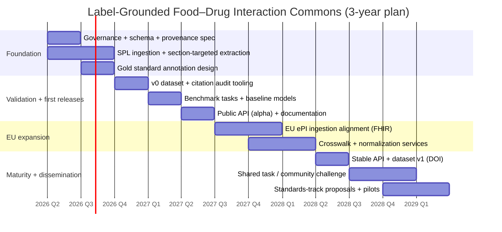
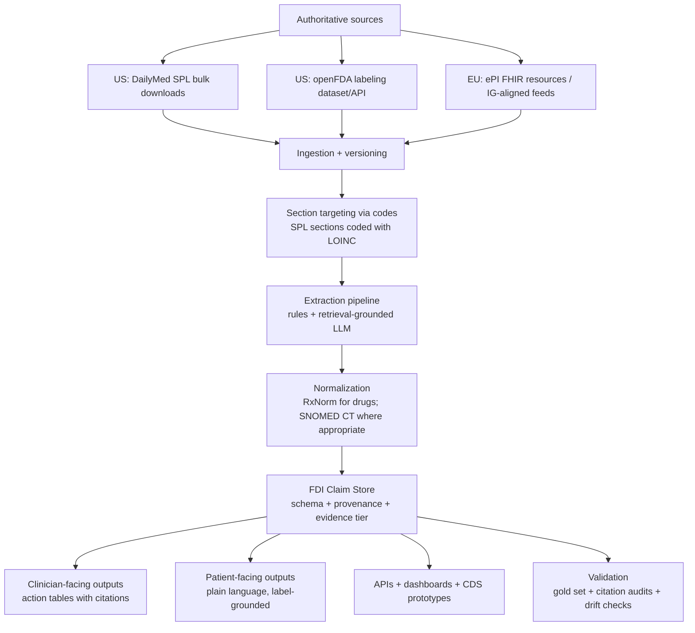

# Value-Maximizing Initiatives in Food–Drug Interaction Labeling and Informatics

## Executive summary

Food–drug interactions (FDIs) and food-effect dosing instructions are explicitly within the scope of US prescription labeling requirements: FDA’s prescribing information must describe clinically significant interactions with foods (including dietary supplements and grapefruit juice) and provide specific practical instructions (with mechanism briefly described if known). citeturn0search0turn0search20 In parallel, the US labeling ecosystem is unusually “data-ready” because Structured Product Labeling (SPL) is an XML-based, HL7 standard used for electronic labeling submissions and dissemination, and SPL section coding (via LOINC section headings) enables section-targeted computational extraction at scale. citeturn0search18turn2search4turn2search1 In the EU, electronic product information (ePI) is being implemented as regulator-authorized, semi-structured product information based on a common EU standard; EMA documents and the ePI portal explicitly state that the EU ePI Common Standard is based on HL7 FHIR and is designed to enable digital dissemination and interoperability. citeturn1search4turn1search0turn1search13

These conditions create a rare opportunity for a single expert leader in clinical pharmacology, regulatory labeling, and biomedical informatics to deliver **high public-health value with clear personal credit** by building foundational, reusable infrastructure that (a) extracts label-stated FDIs and food-effect dosing, (b) preserves provenance and versioning, (c) supports evidence-tier separation (label-stated vs human vs mechanistic), and (d) enables downstream decision support, patient-facing e-labeling, and regulatory modernization. citeturn0search0turn4search2turn1search4

The highest-impact, feasible “keystone” program identified here is a **Label-Grounded Food–Drug Interaction Commons**: an open, versioned, provenance-preserving dataset and API that converts US SPL and emerging EU ePI into structured, evidence-graded FDI claims, with a validation benchmark and “citation audit” requirements to prevent LLM hallucinations and fabricated references. citeturn0search7turn0search3turn1search0turn4search7 This is prioritized because it is: (1) directly aligned with regulator-required content, (2) technically achievable using public labeling infrastructure, and (3) a platform that strengthens multiple other high-value initiatives (EHR integration, dashboarding, pharmacovigilance linkages, and standards development). citeturn0search0turn0search18turn4search1

Because LLM outputs can hallucinate facts and citations, and because fabricated citations are documented as a specific failure mode in scholarly/medical contexts, all LLM use in the proposed portfolio is constrained to **retrieval-grounded extraction/summarization with mandatory provenance and automated citation verification** (i.e., the system must be able to point to the exact label snippet and version for every claim). citeturn4search0turn4search7turn4search12

## Decision framework for value and credit

This report uses a pragmatic prioritization lens: maximize public-health benefit by improving the *availability, actionability, and computability* of FDI / food-effect dosing information that is already required (or strongly expected) to be communicated in labeling, while minimizing regulatory and patient-safety risk by grounding all outputs in regulator-authorized sources and maintaining explicit version provenance. citeturn0search0turn0search36turn4search2

A key “value multiplier” is selecting initiatives that leverage public infrastructures rather than building proprietary silos. The most leverage-ready infrastructures for this domain include: DailyMed SPL bulk downloads (the most recent “in use” labeling submitted to FDA), openFDA labeling APIs/datasets, and the EU ePI FHIR-based standard and implementation materials. citeturn0search7turn0search3turn1search6turn1search0

Evidence-tier clarity is treated as a first-order design requirement:

- **Label-mandated / label-stated**: content required or explicitly present in prescribing information/product information (e.g., US 21 CFR 201.57; EU ePI authorized PI). citeturn0search0turn1search4  
- **Reported in human clinical studies**: interactions and timing sensitivity supported in humans (e.g., classic grapefruit–drug interaction evidence; St John’s wort–cyclosporine clinical consequences). citeturn3search0turn3search17turn3search5  
- **Mechanistic-only**: plausible mechanisms without robust human confirmation; these are kept distinct and never “upgraded” by the model. FDA guidance on food effects describes physiologic mechanisms that can change exposure and drive fed/fasted instructions. citeturn0search9turn0search36  

## Project portfolio

The eight projects below are intentionally designed as a **portfolio**: they can be pursued sequentially or in parallel, and several are mutually reinforcing. Whenever a statement describes an *existing regulatory/infrastructure fact*, it is cited; whenever a statement is a *proposal*, it is phrased as such.

### Label-Grounded Food–Drug Interaction Commons

**Objective (proposed):** Create an open, versioned, provenance-preserving dataset (“FDI Commons”) of label-stated FDIs and food-effect dosing instructions extracted from US SPL (DailyMed/openFDA) and EU ePI (FHIR-based), with an accompanying API, benchmark tasks, and validation tooling.

**Rationale (public-health impact):** FDA labeling must include clinically significant food interactions and practical management instructions, but SPL content is largely narrative and therefore difficult to compute without extraction. citeturn0search0turn0search18 EU ePI is explicitly aimed at delivering regulator-authorized PI in a semi-structured form using a common standard, enabling better digital dissemination and interoperability, which positions it as a natural second pillar for cross-jurisdiction coverage. citeturn1search4turn1search0turn1search13 A centralized, provenance-correct commons reduces duplication and supports consistent downstream outputs (dashboards, CDS, patient-facing e-label views) without re-interpreting clinical meaning.

**Required resources (proposed):**

| Resource category | Minimal viable needs | Notes on authoritative sources |
|---|---|---|
| Data | DailyMed SPL downloads; openFDA labeling dataset; EU ePI FHIR IG artifacts / ePI feeds as available | DailyMed provides “in use” SPL; openFDA returns labeling from SPL; EU ePI common standard is FHIR-based. citeturn0search7turn0search3turn1search6turn1search0 |
| Personnel | You (PI/architect), 1–2 NLP/IE engineers, 1 pharmacometrics/clinical pharmacology reviewer, 1 product data engineer, part-time regulatory labeling SME | Evidence-tier adjudication is essential because labels may differ from FDA-approved versions. citeturn4search2turn4search10 |
| Tech | SPL XML parsing; FHIR ingestion; terminology services; retrieval + extraction pipeline; audit logging | SPL uses LOINC-coded sections; EU ePI common standard uses FHIR resources. citeturn2search4turn2search1turn1search13 |

**Milestones (proposed; 6–12 month phases):**
- **Phase 1 (months 0–6):** Schema + provenance model; SPL ingestion and section-targeted extraction for “Effect of Food,” “Dosage and Administration,” and “Drug Interactions” sections (coded via LOINC). citeturn2search4turn2search1turn0search36  
- **Phase 2 (months 6–12):** Create gold-standard annotation set; evaluate extraction; publish v0 dataset + citation audit tooling; add “current vs FDA-approved labeling” status handling. citeturn4search2turn4search7  
- **Phase 3 (months 12–24):** Add EU ePI ingestion aligned to the EU ePI common standard; produce crosswalk mappings and bilingual/locale readiness as needed. citeturn1search0turn1search13  
- **Phase 4 (months 24–36):** Expand coverage; publish stable API; publish benchmark + shared task for FDI extraction accuracy and provenance correctness.

**Outcomes/metrics (proposed):**
- Coverage: # of products processed; # of label-stated food-effect dosing instructions; # of distinct food triggers normalized.
- Quality: claim-level precision/recall/F1 on a gold set; “provenance validity rate” (all claims trace to an exact snippet/version).
- Adoption: # of downstream users (research groups, CDS prototypes, regulators/industry pilots).

**Regulatory/ethical risks and mitigations:**
- **Risk:** Confusing “in use/current labeling” with “FDA-approved labeling.” FDA explicitly warns current labeling may differ from FDA-approved labeling, and FDALabel notes SPL content may not be verified by FDA. citeturn4search2turn4search10turn0search7  
  **Mitigation (proposed):** Store label source (DailyMed/openFDA/Drugs@FDA linkages where possible), effective date, and a visible status flag; never claim “FDA-approved” unless source is FDA-approved repository.
- **Risk:** LLM hallucinations or fabricated citations. Citation fabrication is documented as a known limitation in academic/medical LLM use. citeturn4search7turn4search0  
  **Mitigation (proposed):** Retrieval-only grounding; mandatory snippet hash; automated citation verification; refuse to output claims without provenance.

**Scalability pathway (US + EU):** US scaling is enabled by SPL bulk downloads and stable SPL section structure; EU scaling is enabled by the FHIR-based ePI common standard and associated implementation guide artifacts. citeturn0search3turn2search4turn1search0turn1search13

### Food-Effect and FDI Label Actionability Benchmark

**Objective (proposed):** Build a transparent “actionability score” framework for food-effect dosing and FDIs, and publish a public dashboard showing patterns of vague vs actionable language, timing specificity, and cross-section consistency.

**Rationale (public-health impact):** FDA guidance ties “Effect of Food” description in Clinical Pharmacology with actionable administration instructions in Dosage and Administration, implying that inconsistent placement or weak instructions can undermine safe use. citeturn0search36turn0search9 Patient-facing readability problems are documented for medicinal package leaflets, supporting the need for better presentation and usability evaluation, especially as labeling becomes more digital. citeturn3search3turn1search4

**Required resources (proposed):**
- Data: SPL sections for food effect + drug interactions; optional EU ePI narrative structures.
- Personnel: labeling linguistics/health literacy expertise; small annotation team.
- Tech: NLP classification; alignment across sections; dashboard.

**Milestones (proposed):**
- Phase 1 (0–6): define rubric; pilot annotation; baseline NLP extraction using LOINC-coded sections. citeturn2search1turn2search4  
- Phase 2 (6–12): scale scoring across a large SPL cohort; publish dashboard + methods paper.
- Phase 3 (12–24): extend to ePI content and compare actionability across jurisdictions where comparable.

**Outcomes/metrics (proposed):**
- % of labels with fully actionable timing guidance (as defined by rubric).
- Cross-section inconsistency rate (instructions present in one section but unsupported/contradicted elsewhere).
- Usability metrics for patient-facing summaries (task-based comprehension tests), aligned with evidence that leaflet readability problems exist. citeturn3search3

**Risks:** Reputational risk for manufacturers if presented as “ranking.” Mitigation: position as a research benchmark aligned with published FDA guidance expectations rather than as a compliance score.

**Scalability pathway:** Pair benchmark outputs with the Commons API to allow third-party consumption; extend rubric to ePI narrative style guidance as ePI expands. citeturn1search4turn1search13

### Food Trigger and Mechanism Normalization Layer

**Objective (proposed):** Create an open normalization layer that maps (1) foods/food constituents (e.g., grapefruit juice; tyramine-containing foods; calcium-containing products) and (2) mechanism categories (CYP inhibition/induction; transporter inhibition; chelation; nutrient competition) into controlled identifiers for computable labeling.

**Rationale (public-health impact):** Clinically important FDIs can involve classic mechanisms supported in human studies, such as grapefruit’s CYP3A effects and St John’s wort–mediated reductions in immunosuppressant exposure associated with rejection risk. citeturn3search4turn3search17turn3search5 Without normalization, extracted label text remains fragmented and difficult to search at the ecosystem level.

**Standards alignment (factual foundation):** RxNorm provides normalized clinical drug names and identifiers enabling interoperability across drug vocabularies, and SNOMED CT is an international clinical terminology designed for consistent representation of clinical concepts. citeturn2search3turn2search6turn2search2turn2search23

**Resources (proposed):** terminology engineering + pharmacology SME + lightweight governance; terminology service; mappings to RxNorm and SNOMED CT where license and scope allow.

**Milestones (proposed):**
- Phase 1 (0–6): define food entity model (food vs beverage vs supplement); create curated seed set of top 100 food triggers from labeling corpus.
- Phase 2 (6–12): integrate drug identifiers via RxNorm; publish mapping tables and normalization API endpoints. citeturn2search3turn2search32  
- Phase 3 (12–24): align mechanism taxonomy to labeling extraction; add EU multilingual considerations.

**Metrics (proposed):** normalization accuracy; synonym coverage; reduction in duplicate entities across corpus.

**Risks:** licensing constraints for some terminologies; mitigate by providing modular mapping layers and clear licensing documentation.

**Scalability pathway:** embed normalization as a shared service consumed by the Commons, dashboards, and CDS prototypes; encourage external contributions under governance.

### LLM-Grounded Label QA and Consistency Copilot

**Objective (proposed):** Develop a “label QA copilot” that checks draft or released labeling for food-effect and FDI content completeness and consistency across sections (Dosage and Administration ↔ Clinical Pharmacology ↔ Drug Interactions), producing issue lists grounded in retrieved snippets.

**Rationale (public-health impact):** FDA’s food-effect guidance illustrates the intended cross-section linkage (action in Dosage and Administration with details in Clinical Pharmacology), making cross-section inconsistency a high-impact target for quality improvement. citeturn0search36turn0search9 FDA’s labeling resources also emphasize that “current/in use” labeling can differ from FDA-approved labeling, so QA tools should explicitly manage versioning and status rather than assuming a single truth. citeturn4search2turn4search10

**Why LLM (and why constrained):** Retrieval-augmented generation (RAG) is a documented approach for grounding generation in retrieved sources and enabling provenance-aware outputs, but hallucinations and citation fabrication remain recognized risks, including in scholarly medical contexts. citeturn4search0turn4search7

**Resources (proposed):** RAG pipeline; rule-based checks (hard constraints) + LLM summarization; regulatory SME review; logging/audit.

**Milestones (proposed):**
- Phase 1 (0–6): build deterministic rules for missing cross-references and missing “Effect of Food” placement; implement retrieval over SPL sections. citeturn2search4turn2search1  
- Phase 2 (6–12): add LLM summarization for issue explanations with mandatory snippet citations; run internal evaluation with citation audits. citeturn4search7  
- Phase 3 (12–24): pilot with EU ePI content structures as available via the FHIR IG.

**Metrics (proposed):** false positive/negative rates for QA checks; citation validity rate; reduction in manual review time in pilot settings.

**Risks:** If deployed beyond QA support, could be misconstrued as “authoritative medical advice.” Mitigation: explicitly limit to labeling QA and provenance output; enforce refusal when evidence is insufficient.

**Scalability pathway:** offer as open-source linting + optional hosted service; integrate into regulatory operations as a non-decision-support tool.

### FHIR-Enabled Clinical Delivery Prototype for Food-Effect Dosing and FDIs

**Objective (proposed):** Demonstrate how label-grounded FDIs and food-effect dosing can be delivered inside clinical workflows (prescribing, dispensing, patient portal) using modern interoperability standards.

**Rationale (public-health impact):** EU ePI is explicitly based on HL7 FHIR and designed for dissemination through electronic channels and integration with healthcare systems, making it a strong foundation for point-of-care access to authoritative instructions. citeturn1search0turn1search13 FHIR is a widely used interoperability standard intended to enable web-style APIs for healthcare system interoperability. citeturn2search13turn2search21turn2search33

**Resources (proposed):** FHIR engineering; terminology mapping; UX; clinical site partner for evaluation.

**Milestones (proposed):**
- Phase 1 (0–6): define data contract: how an FDI claim is represented and retrieved; prototype UI widgets driven entirely by provenance-grounded label snippets.
- Phase 2 (6–12): pilot deployment in a sandbox EHR environment; measure retrieval latency and clinical usability.
- Phase 3 (12–24): extend to EU ePI FHIR IG content structures; run comparative tests (paper/PDF vs ePI-driven UI).

**Metrics (proposed):** time-to-find critical label instruction; clinician correctness on scenario-based tasks; user satisfaction; system uptime.

**Risks:** alert fatigue and over-triggering; mitigation: focus on *information access and search* rather than interruptive alerts as the first deployment mode.

**Scalability pathway:** standards-first output lets others embed the same content; use Commons API as the backend.

### Pharmacovigilance Linkage: Food Mentions ↔ Label Content

**Objective (proposed):** Build a pipeline that detects food mentions and food-related circumstances in adverse event reports, then cross-links them to label-stated FDIs and food-effect dosing instructions to prioritize label clarity updates and education.

**Rationale (public-health impact):** openFDA provides API access to adverse event data collected from FAERS, which contains adverse event and medication error reports submitted to FDA, supporting post-marketing surveillance. citeturn4search1turn4search5 Linking real-world reports to label content can identify where label communication fails (e.g., common misunderstandings about timing/food triggers), even if causal inference is not established.

**Resources (proposed):** safety epidemiology SME; NLP for food mention extraction; governance for non-causal interpretation.

**Milestones (proposed):**
- Phase 1 (0–6): construct food lexicon + NLP detector; validate on a small curated set.
- Phase 2 (6–12): scale to openFDA/FAERS; build dashboard linking to label snippets.
- Phase 3 (12–24): publish methods + limitations; propose label communication improvements grounded in observed reporting patterns.

**Metrics (proposed):** precision/recall of food-mention detection; # of “label gap hypotheses” generated and validated by SMEs; downstream uptake.

**Risks:** Misinterpretation of FAERS signals as causal; mitigation: strict language about reporting bias and hypothesis generation; disclose limitations in all outputs.

**Scalability pathway:** reuse Commons normalization to map foods and drugs; extend to EU pharmacovigilance sources if accessible via partnerships.

### High-Risk FDI “Reference Packs” for Digital Labeling and Education

**Objective (proposed):** Produce evidence-tiered, provenance-grounded “reference packs” for a small set of high-risk, high-frequency FDIs (e.g., grapefruit–drug interactions; St John’s wort–immunosuppressants; levothyroxine–coffee/tea timing effects) with standardized, machine-readable representations and patient-friendly language derived strictly from labels plus a curated human-evidence bibliography.

**Rationale (public-health impact):** Human clinical literature documents meaningful FDIs such as grapefruit–drug interactions via CYP3A mechanisms and St John’s wort interactions associated with decreased immunosuppressant exposure and rejection risk. citeturn3search4turn3search17turn3search5 Levothyroxine absorption interference by coffee/tea has been studied in humans and summarized in reviews, illustrating a common “everyday” FDI with high potential for misunderstanding. citeturn3search14turn3search2turn3search10

**Resources (proposed):** clinical pharmacology curator; labeling SME; plain-language editor; small UX.

**Milestones (proposed):**
- Phase 1 (0–6): select 10–15 “reference pack” topics; compile label-stated content + human evidence.
- Phase 2 (6–12): publish digital packs with provenance and evidence-tier labeling; evaluate comprehension improvements vs standard leaflets.
- Phase 3 (12–24): integrate packs into ePI-driven interfaces and clinician tools.

**Metrics (proposed):** comprehension scores; reduction in time-to-locate key instruction; citation validity.

**Risks:** drifting into dosing advice; mitigation: present only label-stated instructions and general educational cautions, never personalized dosing.

**Scalability pathway:** packs become exemplars for broader structured extraction; can seed standards proposals.

### Standards and Policy Accelerator for Machine-Readable FDIs

**Objective (proposed):** Lead a standards-and-policy effort to add **structured, machine-readable FDI and food-effect dosing fields** to labeling ecosystems, aligned to SPL section codification (LOINC headings) and EU ePI FHIR structures, with explicit provenance and versioning requirements.

**Rationale (public-health impact):** FDA’s SPL guidance and technical documents describe the structured format and the use of coded sections (LOINC) for labeling content, enabling computable labeling at scale but still largely narrative for clinical meaning. citeturn0search18turn2search4turn2search1 EMA’s ePI program explicitly frames ePI as semi-structured regulator-authorized PI and positions the EU common standard (FHIR-based) as a foundation for digital dissemination and interoperability. citeturn1search4turn1search0 A structured interaction model would reduce reliance on brittle NLP extraction and improve safety by enabling deterministic retrieval of interaction claims.

**Resources (proposed):** standards engineering; regulatory affairs; HL7/FHIR community participation; pilot sponsors.

**Milestones (proposed):**
- Phase 1 (0–6): define minimum structured elements for FDI claims (trigger, directionality, mechanism category, action, timing, evidence tier, provenance).
- Phase 2 (6–12): implement as profiles/extensions in a FHIR IG aligned with ePI structures; propose corresponding SPL data elements or conventions.
- Phase 3 (12–24): run pilot conversions for a small set of products; evaluate extraction accuracy and authoring burden.

**Metrics (proposed):** reduction in NLP error vs narrative-only extraction; authoring time; stakeholder acceptance.

**Risks:** slow policy cycles; mitigation: start with non-binding implementation guides and pilot evidence.

**Scalability pathway:** embed into EU ePI IG workflows and US SPL submission tooling over time.

## Prioritization and ranked table

### Explicit prioritization criteria

The ranking uses five criteria scored 1 (low) to 5 (high). These are **proposed decision criteria** (not facts):

- **Impact:** expected reduction in preventable harm / improved correct use.
- **Feasibility:** technical and operational practicality using public data and realistic expertise.
- **Speed-to-benefit:** ability to deliver useful outputs within 6–12 months.
- **Scalability:** ability to scale across products and to US+EU infrastructures.
- **Regulatory risk (inverse):** likelihood outputs could be misused or misconstrued; lower risk scores higher.

The regulatory-risk criterion is particularly important because FDA and FDA-linked labeling repositories explicitly warn that current/in-use labeling may differ from FDA-approved labeling, and because any AI layer introduces hallucination/citation risks that must be contained. citeturn4search2turn4search10turn4search7

### Ranked table

Weights (proposed): Impact 0.35; Feasibility 0.20; Speed 0.15; Scalability 0.20; Regulatory-risk score 0.10.

| Rank | Project | Impact | Feasibility | Speed | Scalability | Regulatory risk score | Weighted score |
|---:|---|---:|---:|---:|---:|---:|---:|
| 1 | Label-Grounded Food–Drug Interaction Commons | 5 | 4 | 4 | 5 | 4 | 4.55 |
| 2 | Label Actionability Benchmark + Dashboard | 4 | 4 | 4 | 4 | 4 | 4.00 |
| 3 | Standards and Policy Accelerator | 5 | 3 | 2 | 5 | 3 | 3.85 |
| 4 | Food Trigger + Mechanism Normalization Layer | 4 | 4 | 3 | 4 | 4 | 3.85 |
| 5 | LLM-Grounded Label QA Copilot | 4 | 3 | 3 | 4 | 3 | 3.50 |
| 6 | FHIR-Enabled Clinical Delivery Prototype | 4 | 3 | 3 | 4 | 3 | 3.50 |
| 7 | Pharmacovigilance Linkage (FAERS ↔ Labels) | 3 | 3 | 3 | 4 | 3 | 3.20 |
| 8 | High-Risk FDI Reference Packs | 3 | 4 | 4 | 3 | 4 | 3.45 |

**Why the Commons is top-ranked:** It leverages the fact that DailyMed distributes SPL at scale and openFDA provides programmatic access to labeling data, while EU ePI is moving toward FHIR-based semi-structured PI—making a cross-jurisdiction, provenance-correct commons technically plausible and a strong enabler for downstream tools. citeturn0search3turn1search6turn1search0turn1search13

## Three-year roadmap for the top-ranked project

### Roadmap overview

The roadmap assumes you lead as PI/architect and publish as the primary author on core technical and evaluation papers, ensuring visible credit through (a) dataset releases with DOI, (b) a benchmark shared task, (c) standards-track drafts, and (d) applied clinical pharmacology publications.

This plan is designed to remain aligned with regulatory realities: “current/in use” labels (DailyMed/FDALabel) may differ from FDA-approved labels, and EU ePI is a structured initiative whose rollout is ongoing; therefore, versioning and status must be central deliverables from Quarter 1. citeturn0search7turn4search2turn1search4

### Mermaid Gantt timeline (quarterly)

### Quarterly milestones with deliverables, collaborators, and translation targets

**Year 1**
- **Q1:** Publish schema + provenance specification (preprint + GitHub), explicitly capturing label source, effective date, SPL section code (LOINC), and “current vs FDA-approved” status fields. citeturn2search4turn2search1turn4search2  
  *Deliverable:* “FDI Claim Schema v0.1” + test suite.  
- **Q2:** Implement SPL ingestion from DailyMed bulk downloads; parse SPL XML and index target sections. citeturn0search3turn2search4  
  *Deliverable:* Reproducible ingestion pipeline + nightly build scripts.  
- **Q3:** Create gold-standard annotation guidelines and begin annotation of a stratified SPL sample focusing on food effect and FDIs. citeturn0search36turn0search0  
  *Deliverable:* Annotation manual + adjudicated dev/test sets.  
- **Q4:** Release dataset v0 (beta) with automated citation-audit tooling (snippet hashing + retrieval verification); submit methods paper emphasizing provenance to mitigate hallucination/citation fabrication. citeturn4search7turn4search0  
  *Deliverable:* DOI-ready dataset package (or archived release) + “citation validity report.”

**Year 2**
- **Q1:** Add baseline extraction models (hybrid rules + retrieval-grounded LLM extraction) and publish benchmark tasks; enforce refusal when evidence is missing. RAG is used specifically for grounding and provenance, not free generation. citeturn4search0turn4search12  
- **Q2:** Launch a public API (alpha) supporting searches by food trigger, mechanism category, and label section; include explicit label status warnings reflecting FDA/FDALabel disclaimers. citeturn4search10turn0search7  
- **Q3:** Begin EU ingestion alignment using EMA ePI FHIR IG structures; define mapping between ePI elements and the Commons schema. citeturn1search0turn1search13  
- **Q4:** Release a cross-jurisdiction pilot subset (US + EU where feasible) and publish a comparative paper on representation differences (narrative SPL vs semi-structured ePI).

**Year 3**
- **Q1:** Stabilize normalization: map drug identifiers to RxNorm; adopt SNOMED CT or equivalent controlled concepts for clinical concept normalization where permitted and useful. citeturn2search3turn2search32turn2search23  
- **Q2:** Release dataset v1 + stable API with long-term governance model; publish usage guide for regulators, CDS developers, and researchers.  
- **Q3:** Run a shared task / community challenge emphasizing (a) claim extraction accuracy and (b) provenance validity as a scored metric, explicitly to prevent “citation drift.” citeturn4search7  
- **Q4:** Translate into standards/policy artifacts (e.g., draft FHIR profiles aligned with ePI structures) and publish implementation results.

**Candidate collaborators (proposed):** academic clinical pharmacology groups; biomedical NLP/IE labs; standards communities; and stakeholders in SPL/ePI ecosystems. EU ePI work is coordinated across the European medicines regulatory network and is documented by EMA, so engagement with ePI-related communities is a plausible pathway. citeturn1search4turn1search1

**Funding sources (proposed):** competitive grants in biomedical informatics and regulatory science; public–private consortia; in-kind support from health IT vendors or academic partners (framed as potential pathways, not guarantees).

**Publication and translation targets (proposed):** clinical pharmacology journal paper (methods + exemplar FDIs), biomedical informatics journal paper (schema + benchmark), and standards-track implementation guide drafts.

## LLM-grounded system implementation blueprint for FDIs

### Ground-truth sources and ingestion

**US ground truth (factual basis):**
- DailyMed distributes the most recent labeling submitted to FDA and currently in use, and provides SPL download resources (full releases and periodic updates). citeturn0search7turn0search3  
- FDA’s Label Search site and FDALabel both explicitly warn that public SPL labeling may not match FDA-approved labeling and may not be verified by FDA. citeturn4search30turn4search10  
- openFDA provides labeling APIs/datasets derived from SPL submissions. citeturn1search6turn4search9  

**EU ground truth (factual basis):**
- EMA defines ePI as regulator-authorized, statutory PI in a semi-structured format; EMA states the EU ePI common standard is based on FHIR and provides ePI FHIR IG documentation resources through the European medicines regulatory network portal. citeturn1search4turn1search0turn1search13  

### Schema and standards alignment

**SPL structure and section targeting:** SPL technical documents describe SPL as structured XML, and FDA resources describe the use of LOINC section headings to code labeling sections/subsections, enabling targeted extraction of “Dosage and Administration,” “Drug Interactions,” and “Clinical Pharmacology/Effect of Food.” citeturn0search18turn2search4turn2search1

**Terminology normalization:**
- Map drug entities to RxNorm normalized identifiers to enable interoperability across drug vocabularies. citeturn2search3turn2search32  
- Map clinical concepts using SNOMED CT where appropriate (e.g., dietary substances as clinical concepts, relevant condition concepts) because SNOMED CT is designed for consistent representation and aggregation of clinical data. citeturn2search23turn2search2  

### Provenance, evidence grading, and safeguards

**Provenance is mandatory** because (a) labeling versions vary over time and (b) current/in-use labeling can differ from FDA-approved labeling. citeturn4search2turn0search7 Each extracted FDI claim carries:
- Source system (DailyMed / openFDA / ePI feed)
- Document identifiers (SPL set ID; ePI identifiers)
- Effective date/version
- Section code (LOINC for SPL)
- Exact snippet text + hash

**Evidence grading (proposed operationalization):**
- **Label-stated:** extracted from labeling snippet (the system treats this as authoritative about what the label says, not as proof of causal truth). citeturn0search0turn1search4  
- **Human clinical:** linked references from peer-reviewed literature (e.g., grapefruit–drug interaction evidence in humans; St John’s wort interactions with immunosuppressants and rejection risk). citeturn3search0turn3search17turn3search5  
- **Mechanistic-only:** mechanism evidence without strong human confirmation; food-effect mechanisms are described in FDA guidance as physiologic factors affecting exposure. citeturn0search9turn0search36  

**LLM constraints (safety-critical):**
- Use RAG to restrict outputs to retrieved evidence; RAG was explicitly introduced to combine parametric generation with retrieved documents and to improve factuality and provenance. citeturn4search0turn4search12  
- Do not allow the model to generate citations; instead, citations are programmatically attached from retrieved snippets, motivated by evidence that LLMs may fabricate plausible-looking but fictional citations. citeturn4search7  

### Validation plan

Validation is designed to detect both extraction errors and provenance failures:

- **Gold-standard evaluation:** claim-level precision/recall referenced to annotated SPL/ePI segments.  
- **Citation audit:** percent of claims for which the cited snippet exactly supports the claim (automated) + manual audits. This is specifically motivated by documented citation accuracy challenges with LLMs. citeturn4search7  
- **Version drift detection:** re-run extraction on new DailyMed releases and compare deltas; this is necessary because labeling is described as a “living document” and FDA notes current labeling can change. citeturn1search6turn4search2  

### Mermaid flowchart for the blueprint

## Thesis questions and policy recommendations

### Concrete, testable thesis and research questions

How often do US SPL labels contain food-effect dosing instructions in Dosage and Administration that are explicitly cross-referenced to “Effect of Food” content in Clinical Pharmacology, consistent with FDA guidance examples? citeturn0search36turn0search9

What fraction of food-interaction statements in SPL are actionable (contain a clear instruction) versus descriptive only, given that FDA requires “specific practical instructions” in the Drug Interactions section? citeturn0search0

How frequently do “current/in use” SPL labels differ from FDA-approved labeling specifically for food-effect dosing and FDIs, and what categories of differences dominate (minor vs moderate changes), based on FDA’s labeling resources explanation? citeturn4search2turn4search10

Can section-targeted extraction using SPL’s coded structure (LOINC section headings) achieve high recall for food-effect and FDI content compared with full-document NLP, and what residual errors are attributable to narrative complexity? citeturn2search4turn2search1

What is the baseline rate of “provenance failure” (claims without snippet support) in unconstrained LLM summarization of labels, and how much is reduced by strict RAG plus automated citation audits? citeturn4search0turn4search7

How reliably can a normalization layer map drug entities in labels to RxNorm identifiers, and what mismatch patterns arise due to multiple identifiers (set IDs, NDCs, application numbers) used across label ecosystems? citeturn2search3turn2search24

To what extent does the EU ePI FHIR-based structure enable more consistent machine-readability for food-effect and FDI content than narrative-only formats, and which elements remain narrative bottlenecks? citeturn1search0turn1search13turn1search4

Which high-risk FDIs (e.g., grapefruit–drug interactions; St John’s wort–immunosuppressants) show the largest gap between human clinical evidence and explicit label clarity across products, as measured by the actionability benchmark? citeturn3search4turn3search17turn3search5

Do digital, search-first presentations of FDI guidance improve user comprehension compared with traditional package leaflets, given systematic evidence of leaflet readability problems? citeturn3search3turn1search4

How effectively can FAERS/openFDA adverse event data support detection of food-related circumstances (as hypothesis generation), and how often do these circumstances correspond to label-stated FDIs? citeturn4search1turn4search5

### Policy recommendations to accelerate safe machine-readable labeling

Adopt explicit, structured fields for food-effect dosing and FDIs in addition to narrative text, building on the existing structured infrastructures (SPL’s coded structure and EU ePI’s FHIR-based common standard). citeturn2search4turn2search1turn1search0

Require machine-readable provenance and version metadata in disseminated labeling artifacts, reflecting FDA’s published explanation that current/in-use labeling can differ from FDA-approved labeling and that public SPL content may not be verified. citeturn4search2turn4search10turn4search30

Standardize controlled vocabularies for food triggers and mechanism categories, with published mappings to interoperable terminologies (RxNorm for drugs; SNOMED CT where appropriate) to reduce ambiguity and improve cross-system interoperability. citeturn2search3turn2search23turn2search2

Incorporate usability and comprehension testing into digital labeling rollouts, motivated by evidence that package leaflets frequently present readability and comprehension problems and by ePI’s stated aim to improve retrieval/access in digital contexts. citeturn3search3turn1search4

For any AI-assisted labeling tools, mandate retrieval grounding and automated citation verification to prevent hallucinations and fabricated citations, which are documented as a risk for LLMs in scholarly/medical contexts. citeturn4search0turn4search7