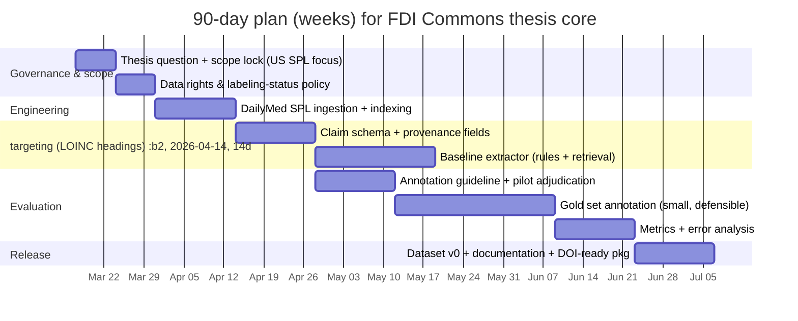

# Master’s Thesis and Venture Fit for a Label-Grounded Food–Drug Interaction Commons

**Executive summary.** I recommend the Label-Grounded Food–Drug Interaction Commons as a strong 6‑month master’s thesis **if I scope it to US SPL labeling (DailyMed + openFDA) and treat EU ePI as a design-compatible extension**, not a full build. The work is academically defensible because FDA labeling rules explicitly require clinically significant food interactions (with practical management instructions), and the US labeling ecosystem is already distributed in machine-processable SPL with section structure that supports computational extraction. citeturn1search2turn9view0turn1search1turn7search2 Entrepreneurially, the highest-value commercial wedge is **provenance-locked extraction + QA** for labeling teams and health-information vendors, with an “open-core” public-good dataset and a paid compliance/QA layer; success hinges on strict provenance and hallucination controls consistent with NIST’s generative AI risk guidance and known citation-fabrication risks in LLMs. citeturn16view0turn15search0

## Thesis suitability and scope for six months

### Thesis suitability assessment within 300 words
A 6‑month master’s thesis is suitable **if I define the thesis goal as: “Create and evaluate a provenance-preserving schema + extraction pipeline that transforms label-stated food–drug interactions and food-effect dosing instructions into structured claims from US SPL.”** This directly aligns with FDA’s requirement that the Drug Interactions section describe clinically significant interactions with foods (e.g., dietary supplements, grapefruit juice) and provide practical instructions plus mechanism when known. citeturn1search2

**Feasible 6‑month deliverables (public-good core):** (a) a minimal FDI claim **schema** with mandatory provenance (source, effective date, section, snippet hash); (b) an **ingestion pipeline** for SPL from DailyMed bulk downloads; (c) a **dataset v0** of extracted food-related claims limited to key sections (Drug Interactions; Dosage & Administration; Clinical Pharmacology/Effect of Food) using SPL section structure; (d) a **gold-standard annotated sample** (small but defensible) for evaluation; and (e) a **methods paper** describing extraction, provenance audits, and baseline performance. citeturn0search1turn7search2turn9view0turn1search1turn11search3

**Primary risks:** DailyMed explicitly states it hosts “in use” labeling that may not match FDA-approved labeling and may not be verified by FDA; therefore, I must build explicit label-status/version fields and avoid over-claiming authority. citeturn9view0 LLM-based extraction/summarization adds “confabulation” and provenance risk, which NIST flags as a key consideration for generative AI systems; I should keep LLM use optional and strictly retrieval-grounded with citation audits. citeturn16view0turn1search3

### How your candidate’s German-military data access changes the thesis
You noted the master’s candidate may access non-public datasets. I would treat any restricted dataset as **optional validation-only** because the thesis’ public-good goal depends on releasable artifacts. If the dataset is classified/export-controlled/proprietary (unspecified), it can block publication, code release, and reproducibility; the safe pattern is to keep the core pipeline on public SPL/openFDA sources and, if permitted, publish only aggregate evaluation results from restricted data under a formal data-use agreement.

## Entrepreneurial and commercialization opportunity

### Market segments and value propositions
The most immediate buyer segments are (i) **labeling/regulatory operations** teams needing consistency checks across sections, (ii) **drug information and clinical knowledge vendors** who need structured FDI facts with provenance, and (iii) **health systems/EHR integrators** who need searchable, up-to-date labeling content flows (especially as EU ePI evolves toward FHIR-based dissemination). citeturn9view0turn2search3turn0search7

My differentiation is **provenance-locked claims**: every extracted FDI claim links to the exact label snippet and version. This matters because DailyMed warns “in use” labeling can differ from FDA-approved labeling and may contain unverified SPL content, and openFDA explicitly cautions not to rely on it for medical-care decisions and notes results are unvalidated. citeturn9view0turn11search3

### Minimal viable product and go-to-market
**MVP (commercial wedge):** “FDI Label QA + Diff” — a web service/API that (a) ingests a label (or tracks SPL updates), (b) detects missing/contradictory food-effect and food-interaction instructions across sections, and (c) outputs an issue report with citations to the exact snippets. This is easier to sell than a broad “CDS engine” because it is clearly bounded to labeling QA and provenance.

**Channels:** partner with regulatory labeling consultancies, SPL tooling vendors, and CERSI networks (below) for pilots; publish an open dataset to drive adoption (“open-core”).

### IP and licensing considerations
openFDA explicitly states its content/data are public domain under CC0 unless otherwise noted, enabling commercial reuse. citeturn7search0turn7search3 By contrast, NLM web policies caution that non-government works encountered on NLM sites may be copyrighted and require permission beyond fair use; I should obtain counsel review for commercial redistribution of large-scale label text vs derived facts/metadata. citeturn14view0 Terminology licensing can also affect commercialization: SNOMED CT US Edition distribution is via NLM to licensed users, and licensing requirements need to be engineered into the product plan. citeturn2search2turn2search6

## US university shortlist for a six-month residency

I prioritize institutions that (a) have **regulatory science infrastructure and FDA collaboration pathways** and (b) can host an informatics-heavy, provenance-focused thesis; FDA’s CERSI program explicitly comprises these centers. citeturn3view0

- **entity["organization","University of California, San Francisco","san francisco, ca, us"] + entity["organization","Stanford University","stanford, ca, us"] (joint CERSI): The UCSF–Stanford CERSI describes itself as a liaison among FDA, academia, and industry—strong fit for labeling informatics plus AI research depth. citeturn3view0turn0search20  
- **entity["organization","Johns Hopkins University","baltimore, md, us"] (CERSI at Bloomberg School of Public Health): Their CERSI emphasizes working directly with FDA and includes drug safety/effectiveness–oriented centers, supporting outcomes- and communication-minded evaluation. citeturn3view0turn5view1  
- **entity["organization","University of Maryland","college park and baltimore, md, us"] (M‑CERSI): M‑CERSI is described as FDA-sponsored and coordinated with FDA’s Office of Regulatory Science and Innovation—good for regulatory-science convening and applied tool-building. citeturn3view0turn5view0  
- **entity["organization","Yale University","new haven, ct, us"] (Yale–Mayo CERSI): Their CERSI explicitly frames infrastructure/tool development to support FDA decision-making and highlights information-science approaches—well aligned to provenance-first datasets. citeturn3view0turn6view1  
- **entity["organization","University of North Carolina at Chapel Hill","chapel hill, nc, us"] (Research Triangle CERSI consortium): Triangle CERSI is an FDA CERSI anchored at UNC with partners including entity["organization","Duke University","durham, nc, us"]; its stated emphasis on emerging technologies and analytic approaches fits an AI-plus-labeling thesis. citeturn3view0turn4view0  

## Ninety-day plan and resource checklist

### Weekly milestones for the first 90 days
This plan assumes the program and supervision structure are **unspecified**; I’m outlining a “default” cadence.

### Resource checklist
**Data access:** DailyMed SPL downloads (public); openFDA labeling API/datasets (public, CC0); optional EU ePI materials for schema compatibility. citeturn0search1turn11search3turn7search0turn2search3turn0search7  
**Standards references:** SPL is an HL7-approved markup standard adopted by FDA; SPL submissions are described in FDA’s content-of-labeling guidance; LOINC section headings support section targeting. citeturn7search2turn1search1turn0search13  
**Compute:** a small VM or lab server is likely sufficient for v0 ingestion/extraction; GPU is optional unless training models (unspecified).  
**Personnel roles:** PI (you), 1 engineer, 1 annotator (part-time), 1 domain adjudicator (could be you).  
**Governance:** label-status/version policy (DailyMed “in use” vs FDA-approved); provenance audit; if using restricted German-military data (unspecified), require formal DUA/security review before any use.

## Metrics for thesis success and early startup validation

### Master’s thesis success metrics
- **Provenance validity rate:** % claims that map to exact snippet + version (target near 100% because DailyMed does not verify SPL content). citeturn9view0  
- **Extraction quality:** precision/recall/F1 on gold set for (food trigger, directionality, action instruction, timing qualifiers).  
- **Version-awareness:** ability to represent the “in use” status and disclaimers, and avoid claiming FDA approval unless sourced accordingly. citeturn9view0  
- **Reproducibility:** end-to-end pipeline reruns from public archives (DailyMed). citeturn0search1  

### Early startup validation metrics
- **Willingness-to-pilot:** number of labeling teams/knowledge vendors agreeing to run the QA report on their portfolio (within 8–12 weeks).  
- **Workflow value:** median time saved per label review cycle (self-reported + sampled).  
- **Safety & trust:** citation audit pass rate and model “confabulation” incident rate; NIST highlights content provenance, testing, and incident disclosure for generative AI risk management. citeturn16view0  
- **LLM risk control:** measured reduction in fabricated citations vs unconstrained generation (important because fabricated references have been observed in medical LLM outputs). citeturn15search0turn1search3  

## Prioritized bibliography

- FDA labeling requirement for food interactions and practical instructions (21 CFR 201.57). citeturn1search2  
- DailyMed “About”: definition of “in use” labeling and disclaimer re FDA-approved labeling/non-verification. citeturn9view0  
- DailyMed SPL bulk downloads (“SPL Resources: Download Data”). citeturn0search1  
- openFDA drug label API (“Responsible use” disclaimer; sectioned labeling). citeturn11search3  
- openFDA terms/license: CC0 public domain dedication (commercial reuse). citeturn7search0turn7search3  
- EMA ePI key principles and definition of semi-structured authorized PI. citeturn1search0  
- EMA statement that EU ePI common standard is based on FHIR. citeturn0search7  
- NIST Generative AI Profile (AI RMF companion) emphasizing content provenance and pre-deployment testing for GAI risk management. citeturn16view0