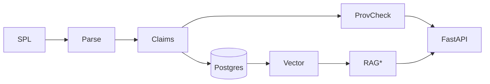
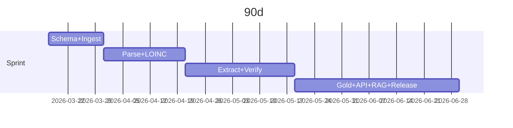

# PRD: Label‑Grounded Food–Drug Interaction Commons

**Exec summary:** In 90 days I will ship **Dataset v0 + API** of **label‑stated** food‑effect dosing/FDI “claims” from US SPL with **prov=1.0** and **retrieval‑only** summaries; no patient‑specific advice.

**A Overview/Value:** Public-good, provenance‑locked computable claims because FDA labeling must describe clinically significant food interactions and give practical instructions. citeturn0search0  
**B Users/Use cases:** clinicians (search “take w/ food”); labeling teams (cross‑section QA); regulators (gap scans); CDS vendors (ground truth); researchers (benchmarks).  
**C Core features:** ingest entity["organization","DailyMed","nih label repository"] SPL zips citeturn0search1 → SPL parser → LOINC section targeting → claim schema {food, drug, dir, action, timing, mechanism?, **evidence_tier**(label/human/mech), **label_status**(in‑use vs approved), **prov**{setId, version/effectiveTime, section, offsets, snippet_hash}}; normalize (RxNorm; SNOMED if licensed); retrieval index; RAG wrapper (retrieve‑only); provenance verifier; REST API; QA dashboard; gold-set+benchmark. EU ePI/FHIR alignment (12mo). citeturn0search3  
**D NFRs:** no PHI; versioned releases; audit logs; prov displayed; latency goal <500ms/query; 99.5% uptime (unspecified infra).  
**E Success metrics:** extraction F1≥0.90 (gold set); provenance validity=1.00; ≥5 external integrations; ≥30% time saved in labeling QA pilots.  
**F 90‑day sprint:** W1‑2 schema+repo+sample ingest; W3‑4 parser+LOINC targeting; W5‑6 rule extractor+prov verifier; W7‑8 annotate gold set; W9 API alpha; W10 retrieval‑only RAG; W11 CI/CD+tests; W12 Dataset v0+audit report.  
**G 12‑mo:** EU ePI mappings; normalization services; shared task; v1 API+dashboard. citeturn0search3  
**H Acceptance/tests (each must pass):** ingest reproducible (same hashes); parser extracts expected sections; extractor emits JSON+offsets; verifier fails if snippet missing/mismatch; API returns deterministic claim sets; RAG refuses w/o prov; dashboard shows drift/audit counts.  
**I Dependencies:** SPL/DailyMed citeturn0search1; entity["organization","openFDA","fda open data"] CC0 citeturn0search2; FDA rule citeturn0search0; EMA ePI/FHIR citeturn0search3.  
**J Cautions:** DailyMed “in‑use” may differ from FDA‑approved and may be unverified. citeturn1search0turn1search1 openFDA is CC0. citeturn0search2  
**K Minimal infra:** S3/obj store + Postgres(+pgvector) + FastAPI + CI (GitHub Actions) + LLM via API (no training required).  
**L QA/Validation:** double‑annotated gold set; precision/recall by entity+claim; provenance audit; citation‑validity tests; drift tests per SPL update.  
**M Governance:** semantic versioning; release notes; refusal rules when prov/evidence missing; public issue tracker.  
**N Next 5 actions:** lock schema; download 1 SPL full release; stand up parser+tests; recruit 1 annotator+adjudicator; define audit/refusal policy.

